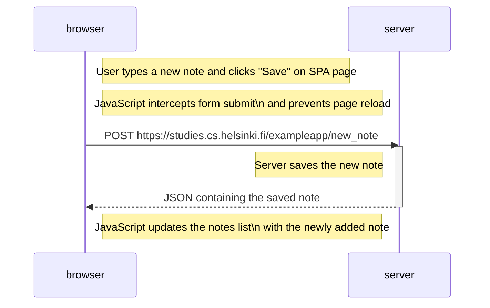

```mermaid
sequenceDiagram
    participant browser
    participant server

    Note right of browser: User types a new note and clicks "Save" on SPA page

    Note right of browser: JavaScript intercepts form submit\n and prevents page reload

    browser->>server: POST https://studies.cs.helsinki.fi/exampleapp/new_note
    activate server
    Note left of server: Server saves the new note
    server-->>browser: JSON containing the saved note
    deactivate server

    Note right of browser: JavaScript updates the notes list\n with the newly added note
```
